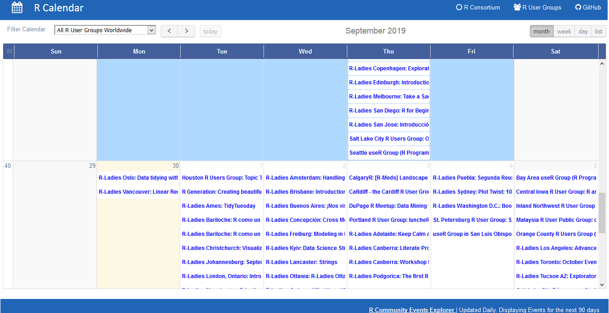

# R Community Event-Explorer
An automated data-driven approach for exploring R events globally using open-source calendars, maps, word-clouds and interactive charts. Exploration covers both past and future events. It is planned to include meetup events, conferences, satRdays, unconferences, community calls, webinars, podcasts, hackathons, and others.

R Calendar: https://github.com/r-community/event-explorer/rcalendar.html

